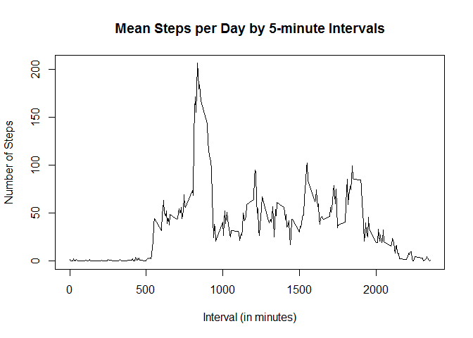
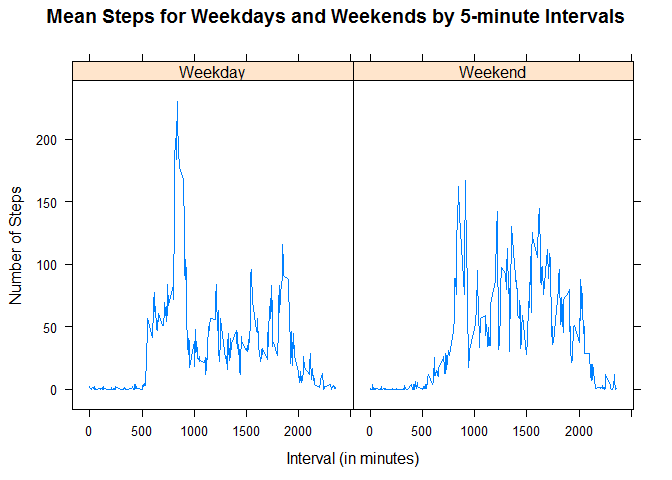

# Reproducible Research: Peer Assessment 1


The data used in this assignment comes from a personal activity monitoring device (such as a Fitbit, Jawbone, etc.). The device collects data at 5 minute intervals and this dataset contains two months of data from a singe individual. 

This assignment reads-in, processes, and analyzes the data to determine some basic insights into activity patterns. 

The variables included in this dataset are:

* steps: Number of steps taking in a 5-minute interval (missing values are coded as NA)

* date: The date on which the measurement was taken in YYYY-MM-DD format

* interval: Identifier for the 5-minute interval in which measurement was taken

The dataset is stored in a comma-separated-value (CSV) file and there are a total of 17,568 observations in this dataset.

## Loading and preprocessing the data


```r
url <- "https://d396qusza40orc.cloudfront.net/repdata%2Fdata%2Factivity.zip"
filename = "activity.zip"

if(!file.exists("activity.zip")){
  download.file(url, filename,method = "curl")
}

if(!file.exists("activity.csv")){
  unzip("activity.zip")
}

activity <- read.csv("activity.csv")

activity$date <- as.Date(activity$date)
```

To begin, we download and unzip the dataset after checking that this has not be done before. Since missing values are already coded as NA we can just use the ```read.csv``` function to load the dataset. Since the date column is read as factor, we convert it to date format. 

## What is mean total number of steps taken per day?


```r
tot_steps_day <- aggregate(steps~date, data = activity, sum, na.rm = TRUE)
hist(tot_steps_day$steps, xlab = "Total Steps per Day", main = "Histogram of Total Steps per Day", col = "red", breaks = 10)
```

<!-- -->

From this histogram of total steps per day, we can see that the mean steps per day appears to be somewhere slightly above 10,000 steps. Although it can be hard to tell just by looking, the median appears to be close to the mean as well. 


```r
summary(tot_steps_day$steps)
```

```
##    Min. 1st Qu.  Median    Mean 3rd Qu.    Max. 
##      41    8841   10760   10770   13290   21190
```
Some simple summary statistics show that our guess it correct with the mean total steps per day being 10,770 steps and the median total steps being 10,760 steps. 

## What is the average daily activity pattern?

```r
mean_steps_int <- aggregate(steps~interval, data = activity, mean, na.rm = TRUE)

with(mean_steps_int, plot(interval, steps, type = "l", xlab = "Interval (in minutes)", ylab = "Number of Steps", main = "Mean Steps per Day by 5-minute Intervals"))
```

<!-- -->

Generating a time-series plot of the avearge number of steps (averaged across all days) and the 5-minute interval, we can see that most steps in the day occur around 8 or 9am. Our anonymous individual could enjoy early morning exercise, or this could be related to a commute (but a second spike in the evening is not shown). Activity throughout the rest of the day is much lower on average, with nightime and sleeping hours showing few to no steps.


```r
mean_steps_int$interval[which.max(mean_steps_int$steps)]
```

```
## [1] 835
```
Calculating where the interval in which the maximum steps occur, we see that the large spike in the graph occurs at 8:35am. 

## Imputing missing values
Our dataset contains some amount of missing values, so we want to examine how extensive this problem is and then deivse a strategy for dealing with it if the problem is extensive enough. 

```r
sum(is.na(activity))
```

```
## [1] 2304
```
2,304 of our rows contain an NA (in the steps column). This is about 13% of our dataset being missing, which is too much to consider unimpactful to our analysis.


```r
replaceNA <- function(int){
  mean_steps_int[mean_steps_int$interval == int,]$steps
}

activity_full <- activity
for(i in 1:nrow(activity_full)){
  if(is.na(activity_full[i,]$steps)){
    activity_full[i,]$steps <- replaceNA(activity_full[i,]$interval)
  }
}
```

The strategy I use to fill in the NA values in the dataset is to replace NAs with the average steps value (across all days) of the 5-minute interval where the NA occurs. 

First, I create a function ```replaceNA``` which takes a 5-minute interval, and returns the steps value for that interval from my previously generated average steps per interval dataframe. 

Then I create a dataframe called "activity_full", which is equal to our intial activity dataset, and iterate through each row, check if its NA, and fill it in with the average 5-minute interval value if it is. 

```r
full_tot_steps <- aggregate(steps~date, data = activity_full, sum)

hist(full_tot_steps$steps, xlab = "Total Steps per Day", main = "Histogram of Total Steps per Day (full data)", col = "blue", breaks = 10)
```

<!-- -->

Using the new full dataset, we create another historgram of total steps per day. Eyeballing it, not a lot appears to have changed.

```r
summary(full_tot_steps$steps)
```

```
##    Min. 1st Qu.  Median    Mean 3rd Qu.    Max. 
##      41    9819   10770   10770   12810   21190
```
In fact, we can see that the mean total steps is the same, and median total steps now matches the mean. Since, we've replaced the missing values with the average of all days for each 5 minute interval, we would expect the median to match the mean when looking at the total steps per day. If these NAs were missing at random (a potential source of this would be randomizing removal for the purposes of this assignment), then we would also expect to see little difference in the mean total steps per day. 

## Are there differences in activity patterns between weekdays and weekends?

```r
activity_full$daytype <- as.factor(ifelse(weekdays(activity_full$date) %in% c("Saturday", "Sunday"), "Weekend", "Weekday"))

full_mean_steps_int <- aggregate(steps~interval + daytype, data = activity_full, mean)

require(lattice)
```

```
## Loading required package: lattice
```

```
## Warning: package 'lattice' was built under R version 3.3.3
```

```r
xyplot(steps~interval|daytype, data = full_mean_steps_int, type = "l", xlab = "Interval (in minutes)", ylab = "Number of Steps", main = "Mean Steps for Weekdays and Weekends by 5-minute Intervals", scales = list(alternating = FALSE))
```

<!-- -->

From these graphs, we can see that clear differences exist in weekend vs. weekday activity. Weekday activity contains the spike of activity around 8:30am and then lower activity throughout the day. Weekend activity contains no distinct spike of activity (suggesting our anonymous individual might skip weekend morning workouts), but has much higher average activity throughout the day. Bedtime on weekends is also clearly later than on weekdays. 
